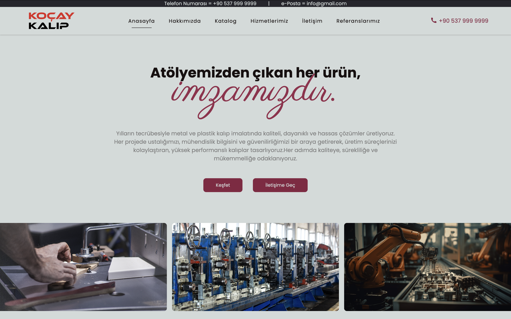

# Frontend Design for Business

This project is a **frontend design and development** for a business website.  
It focuses on providing a **modern, responsive, and user-friendly interface** built with UX (User Experience) principles in mind.

---

### Features
- Fully **responsive** layout for all devices  
- Clean and minimal **UI design**  
- Optimized performance and fast loading  
- Easy-to-edit, well-structured code  
- UX-focused navigation and layout flow  

### Technologies Used
- **HTML5**  
- **CSS3 / SCSS**  
- **JavaScript (ES6+)**  

---

## License

This project is licensed under the MIT License. See the `LICENSE` file for details.

--- 

## Contact

If you have any questions or suggestions, feel free to reach out:  
[GitHub Profile](https://github.com/egeturediCode)

